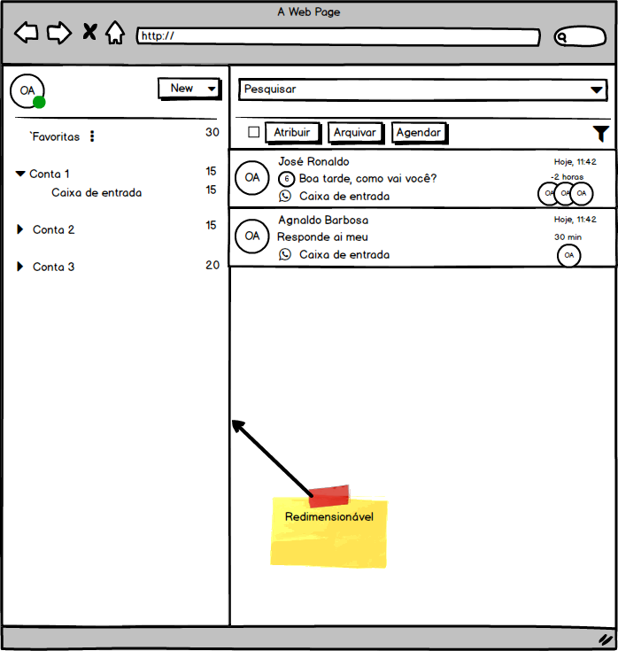
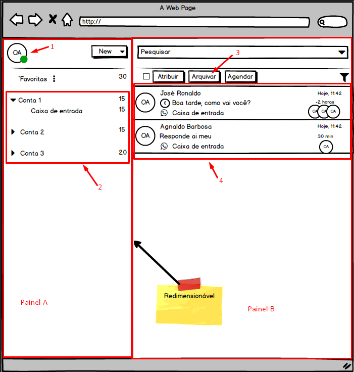
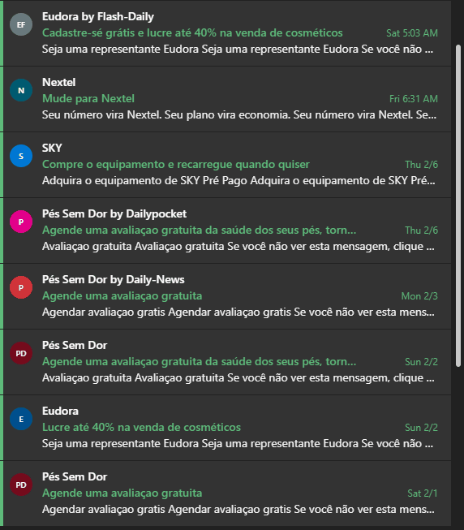

# Teste prático WiiD - Frontend

Obrigado por se interessar em participar do teste para desenvolvedor Front-end da [WiiD](https://wi-id.com).

## O teste

O teste consiste em criar uma pequena aplicação, seguindo os itens abaixo:

1. Utilizar VueJS ou ReactJS.
2. Utilizar as melhores práticas/principios que você conhecer para que o código seja testável e reaproveitável.
3. Os dados serão consumidos através de uma api externa.
4. Utilizar globalização. (Adicionar algum botão para que possa alterar a linguagem).
5. Utilizar tematização. (Adicionar algum botão para que possa escolher o tema: Dark ou Ligth).
6. Criar uma tela de login simples
   1. Somente usuário logado poder acessar a Main page.
   2. Não é necessário validar credênciais, pode utilizar login fixo. (Ex. User: Admin, Pass: Admin).

## Componentes / Comportamentos

1. O componente 1 deve:
   1. Ao clicar apresentar um menu para que possa ser feito o Logout.
2. O componente 2 deve:
   1. Listar a arvore de menu a partir dos items obtidos pela api: http://my-json-server.typicode.com/workinideas/vagafrontendteste/menus
      1. Exemplo:
      - Menu
        - subMenu
        - subMenu
      - Menu
        - subMenu
   2. Ao selecionar um item (subMenu - Caixa de entrada, por exemplo), deve atualizar a listagem representada pelo componente 4, com os itens relacionados ao subMenu.
3. O componente 3 deve:
   1. Ao clicar no botão "Arquivar" os itens selecionados do componente 4 devem ser removidos da listagem.
4. O componente 4 deve:

   1. Apresentar os dados relacionados ao item selecionado no componente 2, através da api:
      --> http://my-json-server.typicode.com/workinideas/vagafrontendteste/items/{id do subMenu}
   1. Cada item (Card) deve apresentar as seguintes informações (Exemplo utilizando o primeiro item da imagem):
      1. Name (José Ronaldo -> Primeiro texto)
      2. Subject (Boa tarde, como vai você? -> Segundo texto)
      3. Owner (OA -> Circulo maior com as iniciais)
      4. Users (OA, OA, OA -> Três circulos menores com as iniciais)
      5. OBS: As demais informações do Card podem ser fixas.
   1. Quando o usuário passar o mouse sobre a linha, deve ser apresentada a opção de selecionar o item da lista (Apresentar um checkbox no lugar das iniciais do Owner).
   1. Ao selecionar o item, todas as Iniciais devem ser apresentadas como opção de seleção para permitir multiplas escolhas.
   1. Ao desmarcar todas as opções, o sistema deve voltar a apresentar as Iniciais.
   1. OBS: Segue um exemplo visual do comportamento desejado extraido de um e-mail Office365:

      

## Finalizando

Qualquer dúvida, fale conosco.  
Fique livre para utilizar a sua criatividade no desenvolvimento dos mockups pode utilziar styles e cores que achar melhor. 

## Agradecimentos

- [Office365](https://office365.com) pela ideia de front-end.
- [Json Generator](https://www.json-generator.com/), que usamos para gerar o Json.
